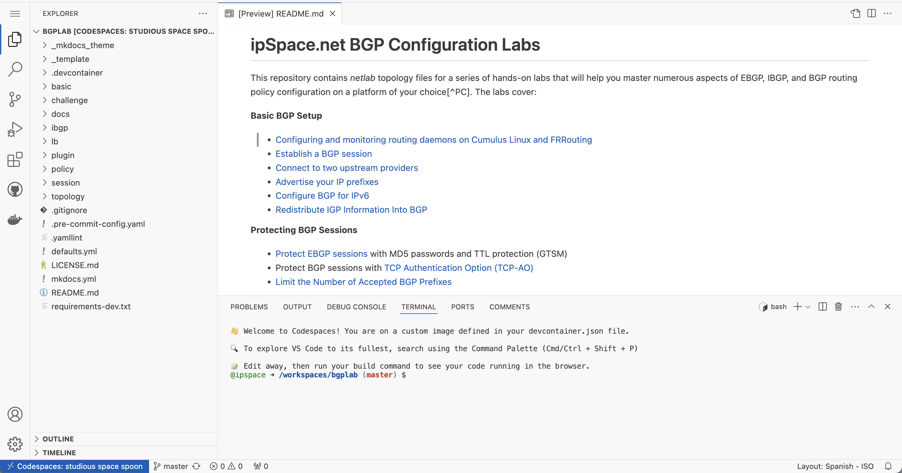
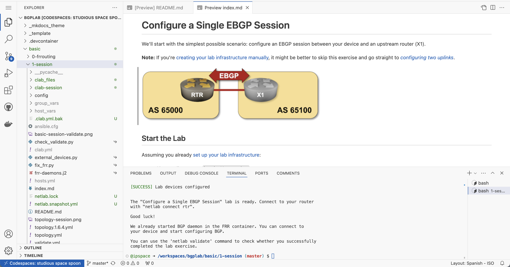

# Use GitHub Codespaces

You can run BGP labs in (free[^UTAP]) [GitHub codespaces](https://docs.github.com/en/codespaces/overview); all you need is a GitHub account:

* [Create a new codespace for your BGP labs](https://github.com/codespaces/new/bgplab/bgplab){:target="_blank"} or [connect to an existing codespace](https://github.com/codespaces){:target="_blank"}.
* Unless you're using GitHub codespaces with VScode (in which case you know what to do), your codespace opens in a new browser window with three tabs: Explorer (repository folders), Preview (starting with README), and Terminal.

[^UTAP]: You get 120 free core hours per month or [pay for more](https://docs.github.com/en/billing/managing-billing-for-github-codespaces/about-billing-for-github-codespaces).

## Select Lab Devices

The BGP labs repository uses Cumulus Linux 4.4 as the default device. To change the device settings, edit the `defaults.yml` file with `vi` or `nano`.
    
!!! tip
    * It's best to use network devices with free-to-download container images (Cumulus Linux, FRR, Nokia SR Linux, Vyos).
    * Use FRR to use the 2 CPU/8 GB codespaces VM with larger labs.
    * Codespaces have persistent storage; you can download and install other containers.
    * To use containers that have to be downloaded from the vendors' website, download them onto your laptop, drag-and-drop them into the Folders, and install them [like you would on a local netlab instance](https://netlab.tools/labs/clab/#container-images).
    * It looks like the Codespaces environment supports nested virtualization, so it should be possible to run network device VMs. However, you're on your own.

## Start a Lab

Once you have the codespaces up and running:

* Click on the desired lab exercise in the README preview window to select the exercise folder.
* Right-click on the exercise folder and select "*Open in Integrated Terminal*" to launch a **bash** session in the desired directory.
* Execute **netlab up** to start the lab.
* Open the exercise folder in the Explorer tab.
* Right-click on the `index.md` file and select "_Open Preview_" to get the exercise description in the preview pane[^BL].
* Connect to your devices with the **netlab connect** command executed in the Terminal pane.

[^BL]: Due to how we use **mkdocs** to generate the HTML version of the lab documentation, the links in the **index.md** Markdown files residing in the exercise directories do not work (one of the side effects of "organic growth"). To get a version with working links, open the corresponding file in the **docs** directory (or start with **docs/index.md**).

## Cleanup and Shutdown

Finally, don't forget to shut down the lab with **netlab down** and stop your codespace after you're done:

* Click on the blue "*Codespaces*" button in the bottom-left corner of the browser window.
* Select "*Stop Current Codespace*". You should also adjust *idle timeout* and *default retention period* in [your codespaces settings](https://github.com/settings/codespaces).