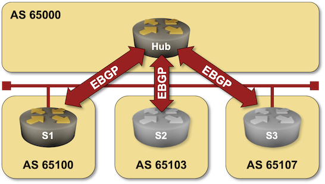

# Passive BGP Sessions

BGP routers continuously try to establish TCP sessions (and start the BGP protocol) with the configured neighbors. That persistence might result in performance challenges when a hub router has hundreds (or thousands) of spoke neighbors that might not always be reachable. In those cases, a *passive* BGP router might offer an advantage; such a router would accept incoming TCP sessions to port 179 but never try to establish a TCP session with its BGP neighbors.

Passive BGP is a rarely used feature but might make sense in these scenarios:

* Route reflectors with many clients,
* Route servers,
* Hubs in large VPN deployments,
* Leaf switches running BGP with servers or virtual machines, 
* BGP monitoring tools, 
* Routers outside a firewall running BGP with an inside router.

In this lab exercise, you'll make the hub BGP router passive and explore what happens with its view of its BGP neighbors as they shut down their BGP sessions.

!!! Tip
    This lab is still under development. Follow [blog.ipspace.net](https://blog.ipspace.net/) or [Ivan Pepelnjak on LinkedIn](https://www.linkedin.com/in/ivanpepelnjak/) to find out when it will be ready.
